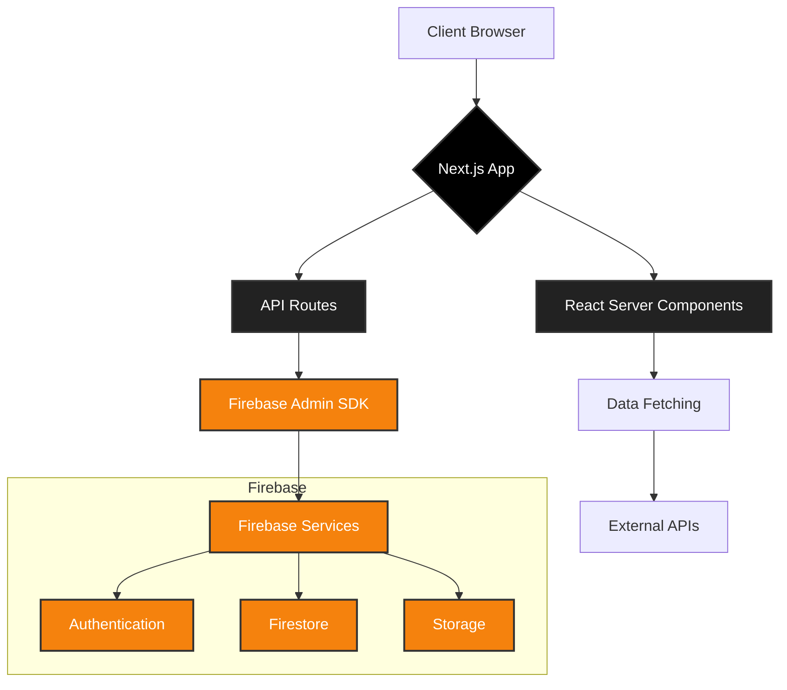

<div align="center">
  <a href="https://git.io/typing-svg"></a>
  

  <!-- Badges -->
  <p>
    <a href="https://github.com/Snapwave333/ProjectBlueBird/blob/main/LICENSE.txt"></a>
    
    <a href="https://github.com/Snapwave333/ProjectBlueBird/fork"></a>
    <a href="https://github.com/Snapwave333/ProjectBlueBird/stargazers"></a>
    <a href="https://github.com/Snapwave333/ProjectBlueBird/issues"></a>
  </p>
</div>

---

## 🌟 About The Project

GameDay is a one-stop platform for gamers. Whether you're a casual player or a competitive enthusiast, GameDay has something for you.

**Key Features:**
*   🎮 **Games:** Explore a vast library of games, read reviews, and find your next favorite.
*   🏆 **Tournaments:** Stay updated on the latest esports tournaments, track schedules, and follow your favorite teams.
*   👕 **Merchandise:** Browse and purchase official merchandise from the biggest names in gaming.

<br/>

 <!-- Placeholder for a real screenshot -->

### 🛠️ Built With

This project is built with the latest and greatest technologies to ensure a smooth and performant user experience.

| Technology | Badge |
|---|---|
| Next.js |  |
| React |  |
| TypeScript |  |
| Tailwind CSS |  |
| Firebase |  |

---
## 🏗️ System Architecture



---

## 🚀 Getting Started

To get a local copy up and running, follow these simple steps.

### Prerequisites

Make sure you have Node.js and npm installed on your machine.
*   npm
    ```sh
    npm install npm@latest -g
    ```

### Installation

1.  Clone the repo
    ```sh
    git clone https://github.com/Snapwave333/ProjectBlueBird.git
    ```
2.  Install NPM packages
    ```sh
    npm install
    ```
3.  Run the development server
    ```sh
    npm run dev
    ```

---

## 🗺️ Roadmap

We have an exciting roadmap ahead of us! Here are some of the features we're currently working on:

*   [x] User authentication and profiles
*   [x] Real-time tournament data integration
*   [x] E-commerce functionality for the merch store
*   [x] Social features to connect with other gamers

See the [open issues](https://github.com/Snapwave333/ProjectBlueBird/issues) for a full list of proposed features (and known issues).

---

## 🤝 Contributing

Contributions are what make the open source community such an amazing place to learn, inspire, and create. Any contributions you make are **greatly appreciated**.

If you have a suggestion that would make this better, please fork the repo and create a pull request. You can also simply open an issue with the tag "enhancement".

1.  Fork the Project
2.  Create your Feature Branch (`git checkout -b feature/AmazingFeature`)
3.  Commit your Changes (`git commit -m 'Add some AmazingFeature'`)
4.  Push to the Branch (`git push origin feature/AmazingFeature`)
5.  Open a Pull Request

---

## 📜 License

Distributed under the MIT License. See `LICENSE.txt` for more information.

---

## 📬 Contact

Your Name - [@your_twitter](https://twitter.com/your_twitter) - email@example.com

Project Link: [https://github.com/Snapwave333/ProjectBlueBird](https://github.com/Snapwave333/ProjectBlueBird)
