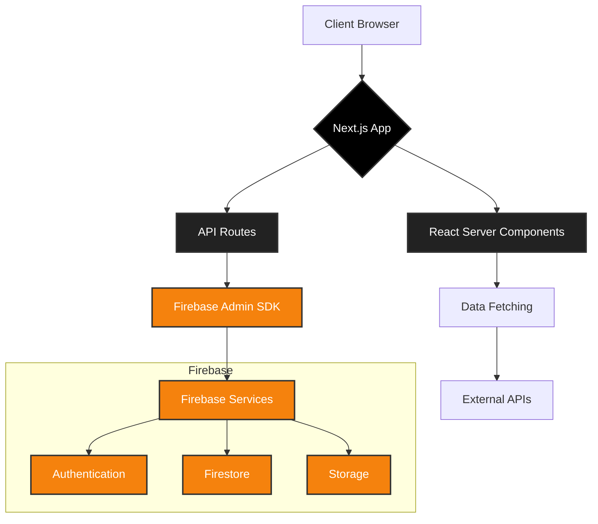

```mermaid
graph TD
    A[Client Browser] --> B{Next.js App};
    B --> C[React Server Components];
    B --> D[API Routes];
    C --> E[Data Fetching];
    D --> F[Firebase Admin SDK];
    E --> G[External APIs];
    F --> H[Firebase Services];
    subgraph Firebase
        H --> I[Authentication];
        H --> J[Firestore];
        H --> K[Storage];
    end

    style B fill:#000,stroke:#333,stroke-width:2px,color:#fff
    style C fill:#222,stroke:#333,stroke-width:2px,color:#fff
    style D fill:#222,stroke:#333,stroke-width:2px,color:#fff
    style F fill:#F5820D,stroke:#333,stroke-width:2px,color:#fff
    style H fill:#F5820D,stroke:#333,stroke-width:2px,color:#fff
    style I fill:#F5820D,stroke:#333,stroke-width:2px,color:#fff
    style J fill:#F5820D,stroke:#333,stroke-width:2px,color:#fff
    style K fill:#F5820D,stroke:#333,stroke-width:2px,color:#fff
```
