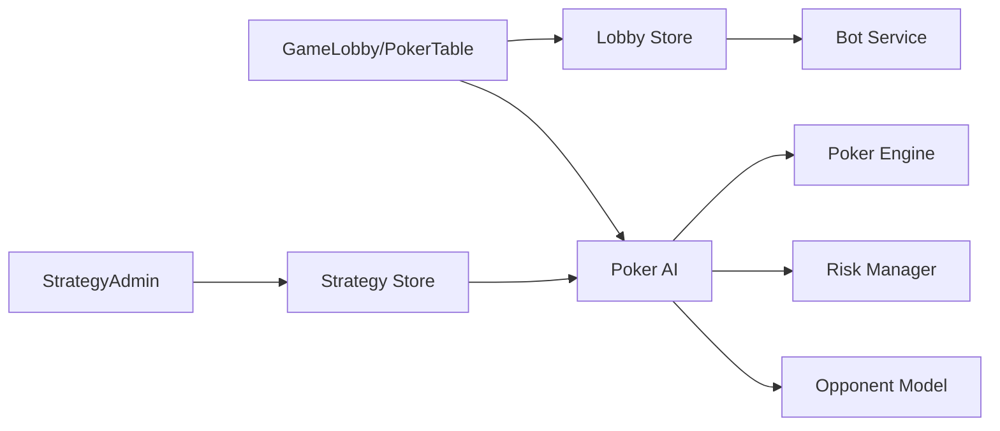

# Architecture

Version: 1.0.0
Last Updated: 2025-11-27

Overview:
- Next.js app with app router, client components for lobby and table
- Core engine in `lib/poker-engine.ts` for deck, stages, evaluation, odds
- AI strategy in `lib/ai/*` with runtime-tunable parameters, opponent model, risk manager
- Lobby store and bot lifecycle in `lib/stores/lobby-store.ts` and `lib/services/bot.service.ts`

Diagram (Mermaid):

Key Modules:
- Engine: `lib/poker-engine.ts:76,105,232,343,419,456`
- AI: `lib/ai/poker-ai.ts:1,37,84,107`
- Strategy store: `lib/ai/strategy-store.ts:1`
- Risk manager: `lib/ai/risk-manager.ts:1`
- Opponent model: `lib/ai/opponent-model.ts:1`
- Bots: `lib/services/bot.service.ts:1`
- Lobby: `lib/stores/lobby-store.ts:1`
